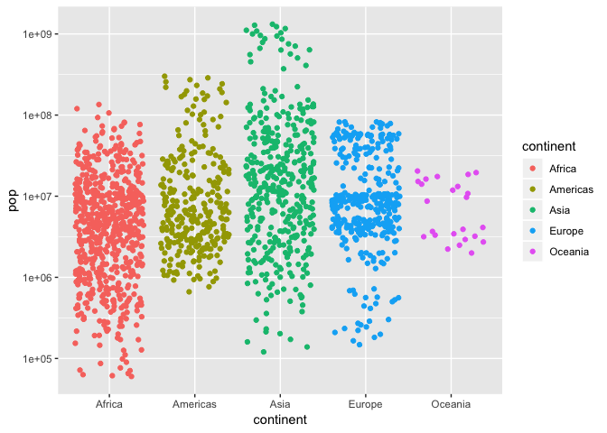
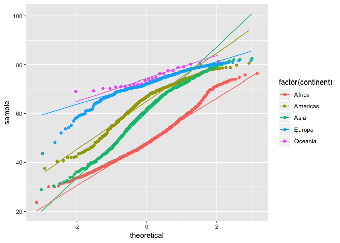

HW2 - Gapminder Dataset Exploration
================
Shuxian Fan
Sep 20, 2018

Source Code
-----------

``` r
# Install the packages
# install.packages("gapminder")
# install.packages("tidyverse")
# install.packages("ggrepel")
# install.packages("waffle")
# install.packages("ggthemes")
# install.packages("knitr")

# Load the packages and data
library(gapminder)
library(tidyverse)
library(ggplot2)
library(scales)
library(waffle)
library(knitr)
library(cowplot)
```

Data Description
----------------

The `gapminder` object is the main data frame from the package `gapminder`. The data frame has 1704 rows and 6 variables, which is demonstrated as:

``` r
# return the type of the gapminder object
class(gapminder)
```

    ## [1] "tbl_df"     "tbl"        "data.frame"

``` r
# return the number of columns and rows of the dataframe.
ncol(gapminder)
```

    ## [1] 6

``` r
nrow(gapminder)
```

    ## [1] 1704

``` r
# dim for data.frame returns the numbers of rows and columns respectively.
dim(gapminder)
```

    ## [1] 1704    6

``` r
# dimnames(gapminder) will give the names of columns and rows of the dataframe. 
# In this case it will give numbers 1:1704 and the names of the variables.
```

Based on the output, we can answer questions that, gapminder object is a data.frame, also tbl and tbl\_df based on its class attribute. In addition, there is no missing data in `gapminer` dataset.

``` r
sum(is.na(gapminder))
```

    ## [1] 0

### Variable Description

The names and data types of the variables are shown as:

``` r
# get the variable name of the data frame.
names(gapminder)
```

    ## [1] "country"   "continent" "year"      "lifeExp"   "pop"       "gdpPercap"

``` r
# extract the class of each variable.
sapply(gapminder, class)
```

    ##   country continent      year   lifeExp       pop gdpPercap 
    ##  "factor"  "factor" "integer" "numeric" "integer" "numeric"

``` r
# sapply(gapminder, typeof)
```

The indicated data type can also be shown in the third row of the output of:

``` r
# get the first parts of the data frame
head(gapminder)
```

    ## # A tibble: 6 x 6
    ##   country     continent  year lifeExp      pop gdpPercap
    ##   <fct>       <fct>     <int>   <dbl>    <int>     <dbl>
    ## 1 Afghanistan Asia       1952    28.8  8425333      779.
    ## 2 Afghanistan Asia       1957    30.3  9240934      821.
    ## 3 Afghanistan Asia       1962    32.0 10267083      853.
    ## 4 Afghanistan Asia       1967    34.0 11537966      836.
    ## 5 Afghanistan Asia       1972    36.1 13079460      740.
    ## 6 Afghanistan Asia       1977    38.4 14880372      786.

Detailed descriptions of the variables can be found in the follwing table:

| Variables   | Description                                           | Type    |
|-------------|:------------------------------------------------------|---------|
| `country`   | names of the countries, a factor with 142 levels      | factor  |
| `continent` | names of the continents, a factor with 5 levels       | factor  |
| `year`      | years ranging from 1952 to 2007 with steps of 5 years | integer |
| `lifeExp`   | life expectancy in years                              | numeric |
| `pop`       | population                                            | integer |
| `gdpPercap` | GDP per capita (US dollars)                           | numeric |

There are 142 different countries and 5 continents included in the dataset. The countries and contonents are listed below.

``` r
# attach the data so that you can directly use a variable without calling it by $
attach(gapminder)
# Number of levels of the country factor.
length(unique(country))
```

    ## [1] 142

``` r
# This can also be attained by head function.
head(unique(country))
```

    ## [1] Afghanistan Albania     Algeria     Angola      Argentina   Australia  
    ## 142 Levels: Afghanistan Albania Algeria Angola Argentina ... Zimbabwe

``` r
length(unique(continent))
```

    ## [1] 5

``` r
unique(continent)
```

    ## [1] Asia     Europe   Africa   Americas Oceania 
    ## Levels: Africa Americas Asia Europe Oceania

``` r
detach(gapminder)
```

Moreover, the data frame includes the data from 1952 to 2007 with increments 5 years.

``` r
# Range and of the year variables.
gapminder%>%
  select(year)%>%
range()
```

    ## [1] 1952 2007

``` r
unique(gapminder$year)
```

    ##  [1] 1952 1957 1962 1967 1972 1977 1982 1987 1992 1997 2002 2007

To see how many countries belong to each continent, we can use a table to illustrate as below. We can see that in this dataset, Africa has the maximum number of countries.

``` r
attach(gapminder)
# create the table of continent and make it a dataframe
mytable = table(continent)
# display it using kable.
mytable %>%
  as.data.frame()%>%
    mutate(prop = Freq/sum(Freq))%>%
          kable(escape = F, format = "markdown")
```

| continent |  Freq|       prop|
|:----------|-----:|----------:|
| Africa    |   624|  0.3661972|
| Americas  |   300|  0.1760563|
| Asia      |   396|  0.2323944|
| Europe    |   360|  0.2112676|
| Oceania   |    24|  0.0140845|

``` r
detach(gapminder)
```

### Summary Statistics

From the basic summary statistics of the variables, we can see that the two numeric variables: life expectancy and gdpPercap, range from 23.60 to 82.60 and 241.2 to 113423.1 respectively. Further exploration on the variables and their interactions using various plots are shown in the following section.

``` r
summary(gapminder)
```

    ##         country        continent        year         lifeExp     
    ##  Afghanistan:  12   Africa  :624   Min.   :1952   Min.   :23.60  
    ##  Albania    :  12   Americas:300   1st Qu.:1966   1st Qu.:48.20  
    ##  Algeria    :  12   Asia    :396   Median :1980   Median :60.71  
    ##  Angola     :  12   Europe  :360   Mean   :1980   Mean   :59.47  
    ##  Argentina  :  12   Oceania : 24   3rd Qu.:1993   3rd Qu.:70.85  
    ##  Australia  :  12                  Max.   :2007   Max.   :82.60  
    ##  (Other)    :1632                                                
    ##       pop              gdpPercap       
    ##  Min.   :6.001e+04   Min.   :   241.2  
    ##  1st Qu.:2.794e+06   1st Qu.:  1202.1  
    ##  Median :7.024e+06   Median :  3531.8  
    ##  Mean   :2.960e+07   Mean   :  7215.3  
    ##  3rd Qu.:1.959e+07   3rd Qu.:  9325.5  
    ##  Max.   :1.319e+09   Max.   :113523.1  
    ## 

Exploratory Data Analysis
-------------------------

### Selective Variable Display

In this section, two variables are displayed using a few interesting tools in R packages `ggplot2`,`dplyr`,`waffle`for data vsual display.

The histograms shown below represent a rough data distribution of the `lifeExp` variable. The first plot shows the count of values of `lifeExp` that lies in some intervals based on the bins we chose. The histogram can show how roughly the data is spread. We can see that the distribution of `lifeExp` is slightly left skewed with most values lie around 70-75. The kernel density plot also clearly shows that there are two humps which indicate that more values lie around these areas. Note that this is just a rough picture of what values can this variable take, we have not used any other information presented in the data yet. This is useful in the sense that when we want to check normality assumption of some variables, histogram can give us some intuition. In our case, `lifeExp` among all continents, countries and years is certainly not normally distributed, which is illustrated by the qq plot below.

``` r
theme_set(theme_gray())
# see the common values of the lifeExp variable using a histogram
g1 = ggplot(gapminder, aes(lifeExp))+
  geom_histogram(bins = 30)

# plot the kernel density
g2 = ggplot(gapminder, aes(lifeExp))+
  geom_histogram(bins= 30,aes(y = ..density..))+
  geom_density()

plot_grid(g1,g2, labels = "AUTO",ncol = 2,scale = c(1.,1.))
```


``` r
# plot the qq plot
ggplot(gapminder, aes(sample = lifeExp))+
  stat_qq()+stat_qq_line()
```


To illustrate a categorical variable, here I present the barplot, pie chart and a "fresher"" waffle plot of the frequencies of the `continent` variable using the ggplot2 package for data visualization. To start with, we would like to create a data frame based on the table of `continent` we generated earlier as ggplot takes a data frame as an input. As we can see, after make the table as a data frame, now the continent row we had in the table became a column in our new data frame `df`.

``` r
# get the table of continent and countries and create a data frame
attach(gapminder)
df = data.frame(table(continent))
head(df)
```

    ##   continent Freq
    ## 1    Africa  624
    ## 2  Americas  300
    ## 3      Asia  396
    ## 4    Europe  360
    ## 5   Oceania   24

``` r
# add more features to the data frame for further use.
df%>%
mutate(prop = scales::percent(Freq/sum(Freq),2)) -> df

bp = 
  df %>%
  ggplot(aes(x="", y = Freq, fill = continent))+
  geom_bar(width = 1, stat = "identity")+   # add the barplot
  scale_fill_brewer(palette="Set2")         # use brewer color palettes
# Free to try out Dark2, Pastel2, Set1
# A detailed page of different brewer color palettes is attached in the Reference section.
bp
```


``` r
pie = bp + coord_polar("y")
pie
```


``` r
detach(gapminder)
```

``` r
vals = as.vector(df$Freq)
# create the names of the values
val_names= sprintf("%s (%s)", c("Asia", "Europe", "Africa","Americas", "Oceania "),df$prop)
names(vals) = val_names
waffle::waffle(vals, size = 0.5,rows = 30)
```


Besides seeing how the variables themselves are distributed, our interest also lies on the additional information given by interacting with other variables. For example, what if we want to answer the following questions:

***Q1: How the population is spread among different continents?***

Boxplot is a easy way to show how a variable distributed by different groups. For example, we can easily see that among the 5 continents, on average, Asian has the highest population but not as high when it comes to GDP per capita. Oceania has the highest GDP per capita on average. And we can also easily detect outlliers and see how spread out the variables are from the boxplot.

``` r
pop_conti = ggplot(gapminder, aes(continent, pop, fill = continent))
pop_conti+
  scale_y_log10()+    # perform the log transformation
  geom_boxplot(outlier.color = "red")+
  scale_fill_brewer(palette="Dark2") # Use the color palette "Dark2"
```


``` r
# There are a few outliers that drag the plot wide that we cannot see the details
# Hereby I remove the observations that have pop >1e10^8 and mainly focus on the major data
gapminder %>%
filter(pop<100000000)%>%
ggplot(aes(pop, fill= continent)) +
  geom_density(alpha=0.4)+
  scale_fill_brewer(palette="Set1")
```


``` r
ggplot(gapminder, aes(continent, gdpPercap,fill = continent))+
  scale_y_log10()+
  geom_boxplot(outlier.color = "red")+
  scale_fill_brewer(palette="Set1")
```


``` r
ggplot(gapminder, aes(log(gdpPercap), fill= continent)) +
  geom_density(alpha=0.4)+
  scale_fill_brewer(palette="Set1")
```


***Q2: Can we get some intuition on how life expectancy relate to the levels of wealth? *** Taking the log transformation is commonly used to make the highly skewed distributions less skewed. A comparision of after and before transfromation is shown below. From the less skewed plot we can get the intuition that wealthy areas tend to have higher life expectancy than areas with less wealth.

``` r
# perform the log transformation of the gdpPercap and create a scatter plot
theme_set(theme_gray())
sc1 = gapminder%>% 
  ggplot(aes(log(gdpPercap), lifeExp, color = continent, shape = continent))+
  geom_point()

sc2 = gapminder%>% 
  ggplot(aes(gdpPercap, lifeExp, color = continent, shape = continent))+
  geom_point()

plot_grid(sc1, sc2, labels = "AUTO")  
```


``` r
# Add a fitted curve to the points
gapminder %>% 
  ggplot(aes(gdpPercap, lifeExp)) + 
  scale_x_log10()+
  geom_point() + geom_smooth(color = "darkgreen")
```

    ## `geom_smooth()` using method = 'gam' and formula 'y ~ s(x, bs = "cs")'


``` r
# Faceting
gapminder %>% ggplot(aes(gdpPercap, lifeExp)) + scale_x_log10()+
  geom_point() + 
  geom_smooth() + 
  facet_wrap(~continent, ncol=3)
```

    ## `geom_smooth()` using method = 'loess' and formula 'y ~ x'


**Q3: *If I want to do some analysis, what about the common assumption of normality?*** Since overall the `lifeExp` does not comply with normal distribution, what if we explore it by the continent? By factoring the qq plot with continent, we can see that the Oceania seems to be approximately normally distributed.

``` r
ggplot(gapminder, aes(sample = lifeExp, colour = factor(continent)))+
  stat_qq()+stat_qq_line()
```



\*\*Q3: \_I am interested in the continent Oceania, and howo can I get a closer look into the `gdpPercap` by year?\*\*

From this plot below we can see the over all trend of the gdpPercap over years along with the individual year distribution of the variable.

``` r
oce = gapminder%>%
  select(continent, year, gdpPercap)%>%       # select only the columns needed
  filter(continent=="Oceania")

oce %>%             # get the data that in the continent Oceania
  ggplot(aes(year, gdpPercap, group = year))+ 
  scale_y_log10()+
  geom_boxplot()
```


**Q4: *I am interested in the country Thailand and Vienam, I would like to see how `lifeExp` and `gdpPercap` spread out with additional information of the population***

With adding the size and color scale based on population, we can easily tell the relative size of the population at each points in the regular scatter plot. It gives us more information in a very straight way.

``` r
gapminder %>% 
  filter(country %in% c("Thailand", "Vietnam"))%>%
  ggplot(aes(log(gdpPercap), lifeExp, shape = country, color = pop, size = pop))+
  geom_point()+
  scale_color_gradient(low = "#0091ff", high = "#f0650e")
```



Reference and Source.
---------------------

`gapminder` Data Source<https://www.gapminder.org/data/>

Brewer Palettes: <http://mkweb.bcgsc.ca/brewer/>
